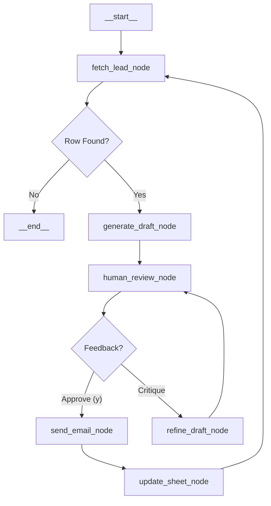

# Project: Agentic Cold Emailer (ACE)

**Objective:** Automate high-quality, personalized internship cold emails using a Human-in-the-Loop (HITL) agentic workflow.

---

## 1. System Architecture

The system is built on **LangGraph** as a stateful graph application. It uses a **Cyclic Graph** topology to allow for infinite feedback loops until the user is satisfied with the email draft.

### 1.1. High-Level Graph Flow



### 1.2. Tech Stack Specification

| Component | Technology | Purpose |
| --- | --- | --- |
| **Orchestration** | `langgraph` | Managing state, cycles, and HITL interrupts. |
| **LLM** | `Vertex AI (Gemini 1.5 Pro)` | High-reasoning model for initial drafting. |
| **Refiner** | `Vertex AI (Gemini 1.5 Flash)` | Low-latency model for rapid edits/refinements. |
| **Frontend** | `rich` (Python lib) | Beautiful CLI for reviewing drafts and diffs. |
| **Email** | `Gmail API` | Sending emails via OAuth 2.0 (High deliverability). |
| **Database** | `Google Sheets API` | Reading leads, updating status. |
| **Persistence** | `Redis` (Docker) | Saving graph state (checkpoints) between runs. |
| **Dependency** | `uv` | Fast Python package management. |

---

## 2. Data Structures & State Management

### 2.1. LangGraph State Schema (`TypedDict`)

This schema defines exactly what data is passed between nodes.

```python
from typing import TypedDict, Optional, List

class AgentState(TypedDict):
    # Workflow Control
    row_index: int              # The current row number in Google Sheet
    iteration_count: int        # Guardrail against infinite loops (max 5)
    
    # Candidate Data (From Sheet)
    recipient_name: str
    company_name: str
    position: str
    recipient_email: str
    
    # Context Data
    resume_content: str         # Loaded from resume.md
    
    # Email Content
    email_subject: str
    email_body: str
    
    # Feedback Loop
    user_feedback: Optional[str] # Specific critique from CLI
    status: str                 # 'drafting', 'reviewing', 'approved', 'sent'

```

### 2.2. Google Sheet Schema

The agent expects a sheet named `Internship_Leads` with these exact headers:

| A | B | C | D | E | F |
| --- | --- | --- | --- | --- | --- |
| **Name** | **Company** | **Position** | **Email** | **LinkedIn** | **Status** |
| *Target Person* | *Target Org* | *Role* | *Target Email* | *Profile URL* | *(Empty/Sent)* |

**Logic:** The `fetch_lead_node` will select the *first* row where `Status` is empty.

---

## 3. Node Specifications

### Node 1: `fetch_lead_node`

* **Input:** Current State (or None).
* **Action:** Connects to Google Sheets. Finds the first row where `Status != "Sent"`.
* **Output:** Updates `row_index`, `recipient_name`, `company_name`, etc.
* **Edge Case:** If no rows are found, returns a special signal to end the graph.

### Node 2: `generate_draft_node`

* **Input:** `resume_content`, `company_name`, `position`.
* **Model:** **Gemini 1.5 Pro**.
* **Prompt Strategy:** "You are an expert career coach. Analyze the resume and the target company. Write a concise, high-impact cold email connecting the user's specific projects to the company's domain."
* **Output:** Updates `email_subject` and `email_body`.

### Node 3: `human_review_node` (The Breakpoint)

* **Action:** This is a **virtual node**. In LangGraph, we will use `interrupt_before=["send_email_node"]` or a dedicated review node that halts execution.
* **CLI UX:**
* Uses `rich.markdown` to render the email beautifully in the terminal.
* Prompts user: `[y] Approve / [type feedback] Refine / [s] Skip`.


### Node 4: `refine_draft_node`

* **Input:** `email_body`, `user_feedback`.
* **Model:** **Gemini 1.5 Flash**.
* **Prompt Strategy:** "Rewrite the email below based strictly on this feedback: '{user_feedback}'. Keep the tone professional."
* **Output:** Updates `email_body`. Increments `iteration_count`.

### Node 5: `send_email_node`

* **Input:** `recipient_email`, `email_subject`, `email_body`.
* **Action:** Uses Gmail API `users.messages.send`.
* **Output:** Returns success metadata.

### Node 6: `update_sheet_node`

* **Input:** `row_index`.
* **Action:** Writes "Sent: {Timestamp}" to Column F (Status).

---

## 4. Implementation Plan & Environment

### 4.1. Directory Structure

```text
/ace-agent
├── /config
│   ├── credentials.json       # OAuth 2.0 Client ID (Download from GCP)
│   ├── token.json             # Generated after first login
│   └── settings.py            # Prompts and Constants
├── /src
│   ├── graph.py               # LangGraph definition
│   ├── nodes.py               # Core logic for each node
│   ├── tools_gmail.py         # Gmail API wrapper
│   ├── tools_sheets.py        # GSpread wrapper
│   └── state.py               # TypedDict definition
├── resume.md                  # Your text-based resume
├── main.py                    # CLI Entry point
├── Dockerfile                 # Redis setup
├── pyproject.toml             # uv dependencies
└── .env                       # API Keys

```

### 4.2. Required `.env` Variables

```bash
GOOGLE_API_KEY=YOUR_API_KEY
GOOGLE_GENAI_USE_VERTEXAI=True    
GOOGLE_APPLICATION_CREDENTIALS="path/to/vertex-key.json"
GOOGLE_PROJECT_ID="your-project-id"
GOOGLE_SHEET_NAME="Internship_Leads"
REDIS_URL="redis://localhost:6379"

```

---

## 5. Security & Safety Protocols

1. **Token Management:** The Gmail API requires a `token.json` (refresh token). The script will handle the initial OAuth handshake on the first run.
2. **Rate Limiting:** We will add a simple `time.sleep(2)` between sheet updates to avoid hitting Google Sheets API quotas.
3. **Spam Prevention:**
* The agent uses your *actual* Gmail account (via API), so it behaves like a normal user sending emails.
* **Limit:** Do not send more than 50-100 emails/day to keep your domain reputation healthy.
