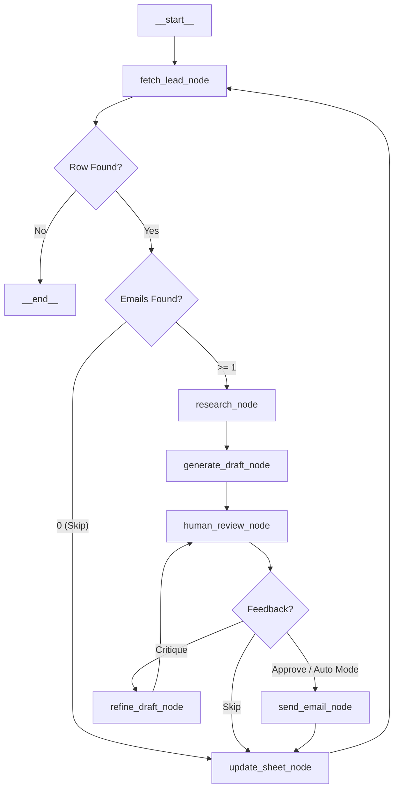

# Project: Agentic Cold Emailer (ACE)

**Objective:** Automate high-quality, personalized internship cold emails using a Human-in-the-Loop (HITL) agentic workflow with autonomous capabilities.

---

## 1. System Architecture

The system is built on **LangGraph** as a stateful graph application. It uses a **Cyclic Graph** topology to allow for infinite feedback loops until the user is satisfied with the email draft.

### 1.1. High-Level Graph Flow


```mermaid
graph TD
    __start__ --> fetch_lead_node
    fetch_lead_node --> check_availability{Row Found?}
    check_availability -- No --> __end__
    check_availability -- Yes --> check_email_count{Emails Found?}
    check_email_count -- "0 (Skip)" --> update_sheet_node
    update_sheet_node --> fetch_lead_node
    check_email_count -- ">= 1" --> research_node
    research_node --> generate_draft_node
    generate_draft_node --> human_review_node
    human_review_node --> feedback_router{Feedback?}
    feedback_router -- "Approve / Auto Mode" --> send_email_node
    feedback_router -- "Critique" --> refine_draft_node
    feedback_router -- "Skip" --> update_sheet_node
    refine_draft_node --> human_review_node
    send_email_node --> update_sheet_node

```

### 1.2. Tech Stack Specification

| Component | Technology | Purpose |
| --- | --- | --- |
| **Orchestration** | `langgraph` | Managing state, cycles, and HITL interrupts. |
| **LLM (Drafting)** | `Gemini 1.5 Pro` | High-reasoning model for initial drafting with structured output. |
| **LLM (Refining)** | `Gemini 1.5 Flash` | Low-latency model for rapid edits/refinements. |
| **Research** | `Google Search` (Vertex AI) | Gathering context on company domain and recent news. |
| **Frontend** | `rich` (Python lib) | Beautiful CLI for reviewing drafts and diffs. |
| **Email** | `Gmail API` | Sending emails or creating drafts via OAuth 2.0. |
| **Database** | `Google Sheets API` | Reading leads, updating status. |
| **Persistence** | `Redis` | Saving graph state (checkpoints) between runs. |
| **Dependency** | `uv` | Fast Python package management. |

---

## 2. Data Structures & State Management

### 2.1. LangGraph State Schema (`TypedDict`)

This schema defines exactly what data is passed between nodes.

```python
from typing import TypedDict, Optional, List

class AgentState(TypedDict):
    # Workflow Control
    row_index: int              # The current row number in Google Sheet
    status_index: int           # The column index of the Status field
    iteration_count: int        # Guardrail against infinite loops (max 5)
    mode: str                   # 'interactive' or 'auto_draft'
    
    # Candidate Data (From Sheet)
    recipient_name: str
    company_name: str
    position: str
    candidate_emails: List[str] # All potential emails found via Regex
    selected_emails: List[str]  # The final choice(s) made by user or default
    
    # Context Data
    resume_content: str         # Loaded from resume.md
    search_summary: str         # Research Context from Google Search
    company_domain: str         # e.g. Fintech, AI, SaaS
    
    # Email Content
    email_subject: str
    email_body: str
    
    # Feedback Loop
    user_feedback: Optional[str] # Specific critique from CLI
    status: str                 # 'drafting', 'reviewing', 'approved', 'sent', 'skipped'
```

### 2.2. Google Sheet Schema

The agent expects a sheet named `Internship_Leads` with these exact headers:

| A | B | C | D | E | F |
| --- | --- | --- | --- | --- | --- |
| **Name** | **Company** | **Position** | **Email** | **LinkedIn** | **Status** |
| *Target Person* | *Target Org* | *Role* | *Target Email* | *Profile URL* | *(Empty/Sent)* |

**Logic:** The `fetch_lead_node` will select the *first* row where `Status` is empty.

---

## 3. Node Specifications

### Node 1: `fetch_lead_node`

*   **Input:** Current State (or None).
*   **Action:** Connects to Google Sheets. Finds the first row where `Status` is empty.
*   **Smart Ingestion:** Performs a "Horizontal Scan" on columns D-Z using strict Regex to find all email candidates.
*   **Mode Handling:** In `auto_draft` mode, automatically selects all found emails as recipients.
*   **Output:** Updates `row_index`, `recipient_name`, `company_name`, `candidate_emails`, `selected_emails` (if auto).

### Node 2: `research_node` (New)

*   **Input:** `company_name`, `recipient_name`.
*   **Model:** **Gemini 1.5 Flash** (with Google Search Retrieval).
*   **Action:** Performs a live Google Search to answer:
    1.  What is the company's core technical domain?
    2.  Recent technical news or blog posts.
*   **Output:** Updates `search_summary` and `company_domain`.

### Node 3: `generate_draft_node`

*   **Input:** `resume_content`, `company_name`, `search_summary`, `company_domain`.
*   **Model:** **Gemini 1.5 Pro** (Vertex AI).
*   **Prompt Strategy:** "You are a direct, systems-focused engineering applicant (IIT Kharagpur)."
    *   **Structure:** Greeting -> Hook (based on research) -> Credibility (Scale/IIT KGP) -> Technical Deep Dive (tailored to domain) -> Double Ask.
    *   **Constraints:** No fluff, no "I hope this finds you well", professional tone.
*   **Output:** Updates `email_subject` and `email_body` using Structured Output (`EmailDraft`).

### Node 4: `human_review_node` (The Breakpoint)

*   **Action:** Acts as an interrupt point in `interactive` mode.
*   **CLI UX:**
    *   Displays the draft using `rich`.
    *   **Multiple Emails:** Warns if multiple emails are found and asks user to select target(s).
    *   **Options:** `[y] Approve`, `[s] Skip`, `[type feedback] Refine`.
*   **Auto Mode:** Passthrough (automatically approves/sends to draft).

### Node 5: `refine_draft_node`

*   **Input:** `email_body`, `user_feedback`.
*   **Model:** **Gemini 1.5 Flash** (Vertex AI).
*   **Prompt Strategy:** "Rewrite the email strictly based on this feedback while maintaining the technical persona."
*   **Output:** Updates `email_body` via Structured Output.

### Node 6: `send_email_node`

*   **Input:** `selected_emails`, `email_subject`, `email_body`, `mode`.
*   **Action:** Uses **Gmail API**.
*   **Interactive Mode:** Sends the email immediately (`gmail.send`).
*   **Auto Draft Mode:** Creates a **Draft** in Gmail folder (`gmail.drafts.create`) for later review.
*   **Output:** Returns success metadata.

### Node 7: `update_sheet_node`

*   **Input:** `row_index`, `status`.
*   **Action:** Writes status to Column F.
    *   **Sent/Drafted:** "Sent: {Timestamp}" or "Drafted: {Timestamp}".
    *   **Skipped:** "Skipped - No Email".

---

## 4. Modes of Operation

### 4.1. Interactive Mode (HITL)
*   **Default Behavior:** Stops at every draft for human review.
*   **User Control:** User can edit prompts, choose emails, or skip leads dynamically.
*   **Safety:** Ensures no email is sent without explicit approval.

### 4.2. Automatic (Draft) Mode
*   **Behavior:** Runs autonomously through the list.
*   **Safety:** Does **NOT** send emails. Instead, it creates **Gmail Drafts**.
*   **Use Case:** Bulk processing leads to be reviewed manually in the Gmail UI later.

### 4.3. Starred Emails Mode (`--starred`)
*   **Behavior:** Iterates through user-starred email threads in Gmail.
*   **Action:** LLM reads the complete thread history, decides if a follow-up is necessary based on context, and generates a suggested draft response.
*   **UX:** Interactive HITL approval. If approved, creates a formatted draft reply attached to the same thread in Gmail.
*   **Use Case:** Efficiently handling follow-ups for warm leads or important conversations that the user has starred manually in their inbox.

---

## 5. Implementation & Environment

### 5.1. Directory Structure

```text
/ace-agent
├── /config
│   ├── credentials.json       # OAuth 2.0 Client ID (Download from GCP)
│   ├── token.json             # Generated after first login
│   └── settings.py            # Constants, logging, env validation
├── /src
│   ├── graph.py               # LangGraph definition
│   ├── nodes.py               # Core logic for each node
│   ├── prompts.py             # Centralized prompt definitions
│   ├── analytics.py           # Event tracking & A/B testing analytics
│   ├── tools_gmail.py         # Gmail API wrapper (send, draft, validate)
│   ├── tools_sheets.py        # Google Sheets wrapper
│   ├── google_auth.py         # Auth helpers (with caching)
│   └── state.py               # TypedDict definition
├── resume.md                  # Your text-based resume
├── main.py                    # CLI Entry point
├── docker-compose.yml         # Redis setup
├── pyproject.toml             # uv dependencies
└── .env                       # API Keys
```

### 5.2. Required `.env` Variables

```bash
GOOGLE_API_KEY=YOUR_API_KEY
GOOGLE_GENAI_USE_VERTEXAI=True    
GOOGLE_PROJECT_ID="your-project-id"
GOOGLE_SHEET_NAME="Internship_Leads"
REDIS_URL="redis://localhost:6379"
```

---

## 6. Security & Safety Protocols

1.  **Dual-Identity Authentication:**
    *   **AI Compute Identity:** Uses `GOOGLE_API_KEY` and `GOOGLE_PROJECT_ID` (defined in `.env`) to bill the Vertex AI usage.
    *   **Sender Identity (OAuth 2.0):** Uses `credentials.json` (Desktop App flow) to authenticate a *specific* Gmail user (e.g., your professional email) for sending mails and editing sheets.
2.  **Rate Limiting:** Added delays between sheet updates to respect quotas.
3.  **Spam Prevention:**
    *   **Draft Mode:** Allows bulk generation without risk of accidental mass sending.
    *   **Daily Limit:** Recommended max 50-100 emails/day.
